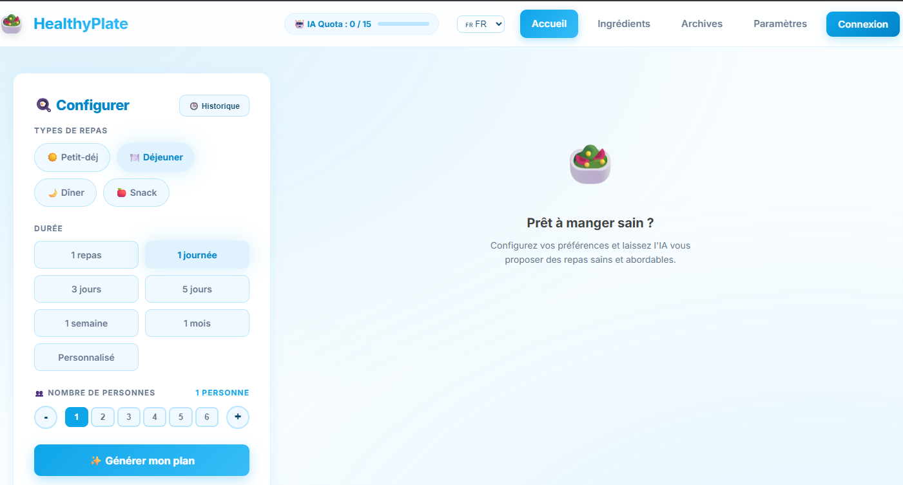
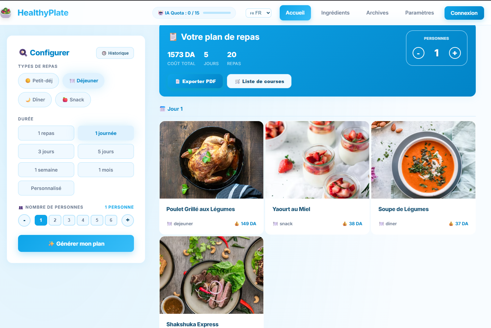
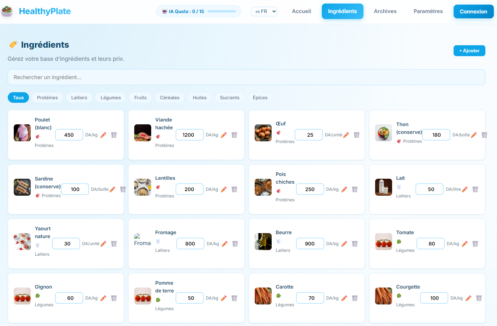
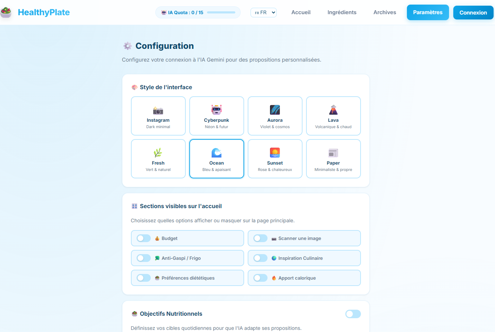
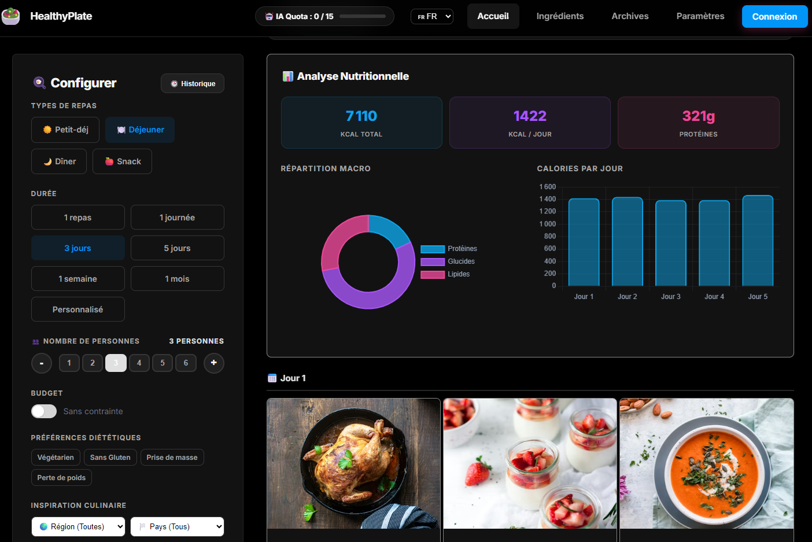

# 🥗 HealthyPlate

<div align="center">
  <p><strong>Votre planificateur de repas intelligent et économique, propulsé par l'IA.</strong></p>
  <p>
    <a href="#fonctionnalités">Fonctionnalités</a> •
    <a href="#technologies">Technologies</a> •
    <a href="#installation">Installation</a> •
    <a href="#configuration-de-lia">Configuration IA</a> •
    <a href="#contribuer">Contribuer</a>
  </p>
</div>

---

## 📖 À propos

**HealthyPlate** est une application web Open-Source conçue pour générer des plans de repas sains, équilibrés et adaptés à votre budget. En utilisant la puissance de l'Intelligence Artificielle (Google Gemini), elle calcule les coûts exacts de vos repas en fonction des prix locaux de vos ingrédients.

Initialement pensé pour le dinar algérien (DA), ce projet est entièrement personnalisable pour n'importe quelle monnaie et n'importe quelle culture culinaire !

## ✨ Fonctionnalités

- 🤖 **Génération par l'IA** : Créez des plans sur-mesure (1 jour, 1 semaine...) avec une IA créative et variée.
- 💰 **Respect du Budget** : Indiquez votre budget maximum, l'IA adapte les repas en conséquence.
- 🥶 **Frigo Anti-Gaspi** : Indiquez ce que vous avez dans votre frigo, l'IA construit les repas autour (coût 0 DA !).
- 🥗 **Préférences Diététiques** : Végétarien, Sans Gluten, Prise de masse, Perte de poids — l'IA s'adapte.
- 📊 **Graphiques Nutritionnels** : Donut de répartition des macros + graphe des calories par jour (Chart.js).
- 👨‍🍳 **Recettes Détaillées** : Cliquez sur un repas pour voir les ingrédients et les étapes de préparation.
- 🛒 **Liste de Courses Auto** : Consolide et additionne tous les ingrédients de la semaine.
- 📱 **Export WhatsApp** : Envoyez votre liste de courses directement sur WhatsApp.
- 💾 **Archivage Intelligent** : Sauvegarde automatique avec cache anti-doublon (économise les tokens IA).
- 🎨 **3 Thèmes UI** : Instagram Dark (défaut), Cyberpunk (néon vert), Aurora (cosmos violet).
- 📱 **Progressive Web App (PWA)** : Installable sur smartphone ou PC comme une app native.
- 📄 **Export PDF** : Téléchargez votre plan de repas complet.

## 📸 Captures d'écran

<div align="center">
  
  
  
  
  
</div>

## 🛠️ Technologies

- **Frontend** : React.js (Vite), Vanilla CSS (UI style "Instagram Explore").
- **Backend** : Node.js, Express.js.
- **Base de données** : PostgreSQL (avec un *Fallback* en fichier `database.json` si la BDD n'est pas installée).
- **IA** : API Google Gemini (`@google/generative-ai`).
- **Déploiement** : Docker & Docker Compose (inclus).

---

## 🚀 Installation (Local)

Vous pouvez lancer l'application de deux manières : avec ou sans Docker.

### Option 1 : Avec Docker (Recommandé)
Si vous avez [Docker Desktop](https://www.docker.com/) installé, l'installation se fait en une seule commande :

```bash
docker-compose up -d --build
```
L'application sera disponible sur `http://localhost:5173`.

### Option 2 : Installation manuelle (Node.js)
Assurez-vous d'avoir Node.js v18+ installé.

**1. Lancer le Backend :**
```bash
cd backend
npm install
npm run dev
```

**2. Lancer le Frontend (dans un autre terminal) :**
```bash
cd frontend
npm install
npm run dev
```

> **Note :** Si vous n'avez pas PostgreSQL d'installé, pas de panique ! L'application basculera automatiquement sur un mode "Fichier local" (`database.json`) pour sauvegarder vos données.

---

## 🔑 Configuration de l'IA (Gemini)

Pour que la génération fonctionne, vous devez posséder une clé API Google Gemini (Gratuite).

1. Allez sur [Google AI Studio](https://aistudio.google.com/) et créez une clé API.
2. Dans l'application HealthyPlate, allez dans l'onglet **⚙️ Config**.
3. Collez votre clé API. Elle sera stockée de manière sécurisée et l'IA sera instantanément activée !

## 🤝 Contribuer

Les contributions sont les bienvenues ! Que ce soit pour ajouter de nouveaux régimes, traduire l'application, ou améliorer l'algorithme de génération.

1. Forkez le projet.
2. Créez votre branche de fonctionnalité (`git checkout -b feature/AmazingFeature`).
3. Commitez vos changements (`git commit -m 'Add some AmazingFeature'`).
4. Poussez vers la branche (`git push origin feature/AmazingFeature`).
5. Ouvrez une Pull Request.

## 📄 Licence

Distribué sous la licence MIT. Libre à vous de l'utiliser, le modifier et le partager !
